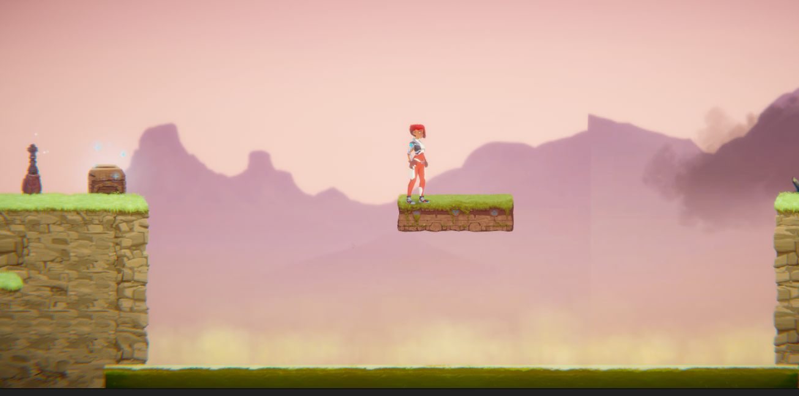

# COMP2150  - Level Design Document
### Name: Luke Dunstan
### Student number: 46465375 

This document discusses and reflects on the design of your platformer level for the Level Design assessment. It should be 1500 words. Make sure you delete this and all other instructional text throughout the document before checking your word count prior to submission. Hint: You can check word count by copying this text into a Word or Google doc.

## 1. Player Experience (~700 words)

### 1.1. Discovery

In this level, the player learns many new mechanics and in turn new dynamics to be used with those mechanics. each encound that the player has with a new mechanc has been designed in a way that is clear and easy for the player to learn the mechanic, for example, in the first encounter of the game, the player is introduced to acid, moving platforms, checkpoints, and health pickups. While it could be seen as too many new ideas thrown as the player, each mechanic works in tandem to seamlessly teach the player about them, the player tries to jump onto the moving platform but falls into the acid, thereby respawning at the checkpoint and regaining a heart from the health pickup.

### 1.2. Drama

A good intensity curve keeps a balance between tense and relaxed situations. I believe my level design achieves this curve through the level hub in the middle as a safe homeground and the intesity slowly ramping up in intensity as the player progresses through the level sections from the "tutorial" section 1, to the enemy filled puzzle section 2, to finally the tense acid lake and enemy wave in section 3. 
  

### 1.3. Challenge

The main challenges of this level are, in order; learning the mechanics, completing the puzzle section while defeating spawning enemies, traversing the acid lake platforms while dodging enemie spits and then defeating the wave of enemies protecting the key for section 3. this level keeps the player in the flow channel by letting the player learn and become confortable with game mechanics before introducing new dynamics to be formed and putting the player into areas with a higher density of enemies. fo4r example, the player first learns of the pushable boxes in section 1 of the level. section 2 builds on this mechanic and creates the new dynamic of using the boxes as height boosts while also creating an unsafe area with spawning enemies.
 

### 1.4. Exploration
How does your level design facilitate autonomy and invite the player to explore? How do your aesthetic and layout choices create distinct and memorable spaces and/or places?

## 2. Core Gameplay (~400 words)
A section on Core Gameplay, where storyboards are used to outline how you introduce the player to each of the required gameplay elements in the first section of the game. Storyboards should follow the format provided in lectures.

Storyboards can be combined when multiple mechanics are introduced within a single encounter. Each section should include a sentence or two to briefly justify why you chose to introduce the mechanic/s to the player in that sequence.

You should restructure the headings below to match the order they appear in your level.

### 2.1. Acid, Moving Platforms, Checkpoints, Health Pickups

### 2.2. Chompers, Weapon Pickup (Staff)

### 2.3. Passthrough Platforms

### 2.4. Keys

### 2.5. Spikes

### 2.6. Spitters, Weapon Pickup (Gun)

## 3. Spatiotemporal Design
A section on Spatiotemporal Design, which includes your molecule diagram and annotated level maps (one for each main section of your level). These diagrams may be made digitally or by hand, but must not be created from screenshots of your game. The annotated level maps should show the structure you intend to build, included game elements, and the path the player is expected to take through the level. Examples of these diagrams are included in the level design lectures.

No additional words are necessary for this section (any words should only be within your images/diagrams).
 
### 3.1. Molecule Diagram

### 3.2. Level Map – Section 1

### 3.3.	Level Map – Section 2

### 3.4.	Level Map – Section 3

## 4. Iterative Design (~400 words)
Reflect on how iterative design helped to improve your level. Additional prototypes and design artefacts should be included to demonstrate that you followed an iterative design process (e.g. pictures of paper prototypes, early grey-boxed maps, additional storyboards of later gameplay sequences, etc.). You can also use this section to justify design changes made in Unity after you drew your level design maps shown in section 3. 

You should conclude by highlighting a specific example of an encounter, or another aspect of your level design, that could be improved through further iterative design.

## Generative AI Use Acknowledgement

Use the below table to indicate any Generative AI or writing assistance tools used in creating your document. Please be honest and thorough in your reporting, as this will allow us to give you the marks you have earnt. Place any drafts or other evidence inside this repository. This form and related evidence do not count to your word count.
An example has been included. Please replace this with any actual tools, and add more as necessary.

### Tool Used: ChatGPT
**Nature of Use** Finding relevant design theory.

**Evidence Attached?** Screenshot of ChatGPT conversation included in the folder "GenAI" in this repo.

**Additional Notes:** I used ChatGPT to try and find some more relevant design theory that I could apply to my game. After googling them, however, I found most of them were inaccurate, and some didn't exist. One theory mentioned, however, was useful, and I've incorporated it into my work.

### Tool Used: Example
**Nature of Use** Example Text

**Evidence Attached?** Example Text

**Additional Notes:** Example Text

